# Task Smasher!

Task Smasher is a life-hack website aiming to create not just a useful resource, but also a community of time-starved people -- ultimately, with the motivation of gaining more free time. Currently, the idea is that more and more people will send in their own life hacks, and the best of them will replace the previous winners every month. Along with helpful content, the site is designed to always have the option to join the newsletter or otherwise get in touch readily available, since community interaction is vital for its survival.

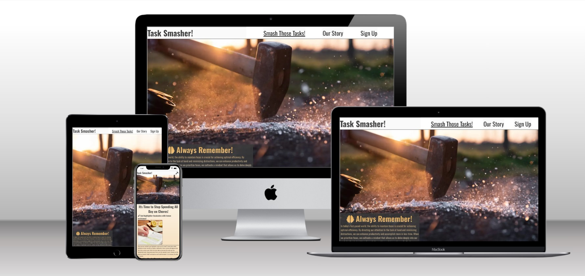

## Features 

### Sitewide
* Navigation Menu
    * Links to "Smash Those Tasks!" (home), "Our Story" (about), and Sign Up pages
    * This menu is responsive, and changes its design based on the viewing device (see responsiveness section for more info).
    * The fixed position of the nav bar will keep users from having to scroll back up to the top to reach the two other pages.
    * Each page has its name underlined on the nav menu, meaning there's no way to get confused about which page a user is on.


* Footer
    * Links to Youtube, Instagram, and Facebook, all of which open in a new tab -- these are focused towards the bottom-left side of the footer.
    * A subscribe bar is present in the footer on the pages index.html and our_story.html, allowing readers to subscribe without going to signup.html.

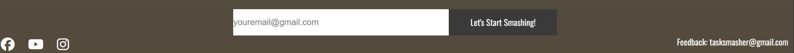
* Favicon
    * A miniature version of the image found on index.html on larger devices serves as the favicon.
    * By using an icon that sticks with the blacksmith aesthetic of the website, users will easily be able to tell which tab contains Task Smasher.


* Satisfying Buttons
    * Interactive elements across the site are designed in such a way as to make it feel good to click and hover them.
    * This means that the navbar icons show a hammer on mouseover and a downward-facing hammer on click.
    * The centerpiece images on index.html and our_story.html, as well as the signup form on signup.html, all pulse on interaction.
    * The signup button on signup.html will also change to orange on click, making the illusion of a hammer hitting hot iron when combined with the grey pulsing animation
    * The signup form in the footer has no effects like this since that would distract from the site's main content and become awkward for the user experience.

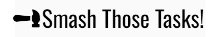

 - Hero Image
    * A large picture of a hammer striking the ground, surrounded by broken
   glass.
    * This picture is present on all screens and on all devices, helping   
   maintain a consistent feel across the site.


 - Secondary mindset box
    * On larger devices, a box between the hero image and the page's
   content displays This box changes on every tab, with the intention of
   cheering on the page user.
    * Each page's mindset box is focused on things to keep in mind, other
   than the signup page, which assumes the user is already aware --
   instead, it further encourages them to commit.
    * This allows the signup page to be short and succinct, having only one
   clear thing to do with minimal distraction.
   
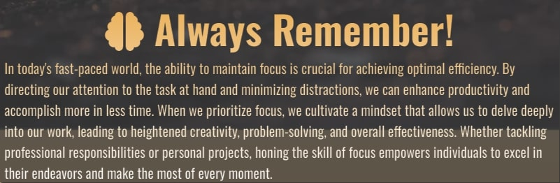
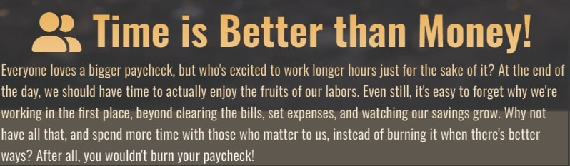
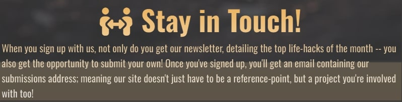

### Landing Page
* The life hacks themselves
    * This is a collection of four life hacks, initially chosen by the website creator, but with the intent of being a sort of competition.
    * Users will submit their own lifehacks through the email in the footer, or by subscribing and getting the email that way.
    * Every month, four new lifehacks will be selected for the front page. This friendly competition will encourage users to consistently return to the site.

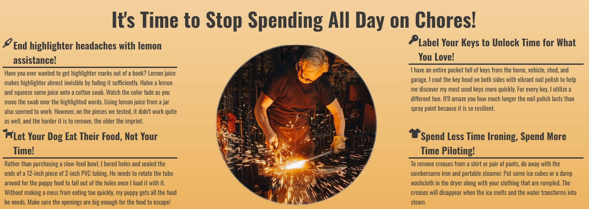
* Secondary attention-grabbing picture
    * On larger devices, the pictures of the lifehack are replaced by a central picture of a blacksmith.
    * This allows users on larger devices to have greater visual appeal since the short nature of the life-hack descriptions means less interactivity on devices that require less scrolling.
    * Further, this image is interactive, pulsing when moused over.


### Story Page
* The backstory
    * The website reads left to right, taking the users on the journey of what inspired this site.
    * This page functions to both build trust in the users and set the website apart from other life-hack sites.
    * By sharing these personal backstories, as well as a clear goal, the story page will hopefully generate a humanizing response and emotional tie-in with the users.
    * The last paragraph ends with a link to signup.html, further herding users to subscribe to the website and, hopefully, add to its content.

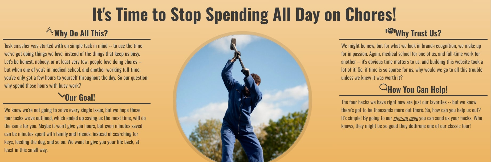
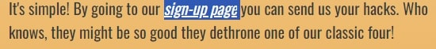

### Sign Up Page
* Quick, to the point
    * In contrast to the other two pages, this page only has a field to input their email and press subscribe.
    * While technically content that was available on the other two pages, the reasoning behind this page is to have an *extremely* clear call-to-action, as well as a reference point for the story page to lead to.
    * To compensate for the relatively sparse content on this page, however, the mindset box serves as a final "closing" to get the user to subscribe to the newsletter.
    * In contrast to the footer's email form, this one is rewarding to interact with, pulsing on mouseover and activation.
    * As previously mentioned, the form button also switches color to mimic the color of steel after being hit with a blacksmith's hammer.
    * The footer on this page, rather than a second signup form, contains links to the other two pages -- just in case the user is unsure of committing just yet.
    * Successful signup leads to a success page.

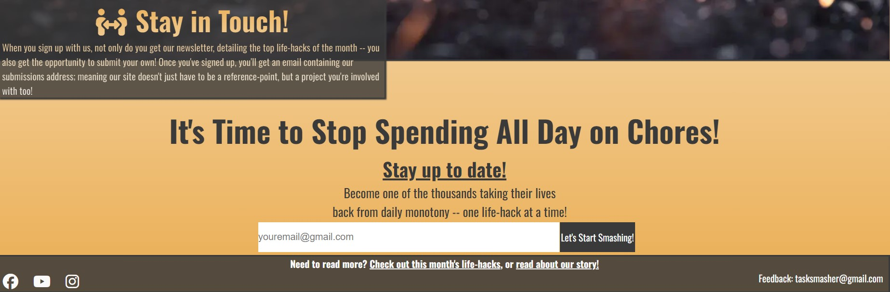
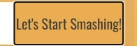
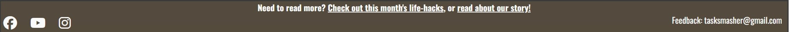
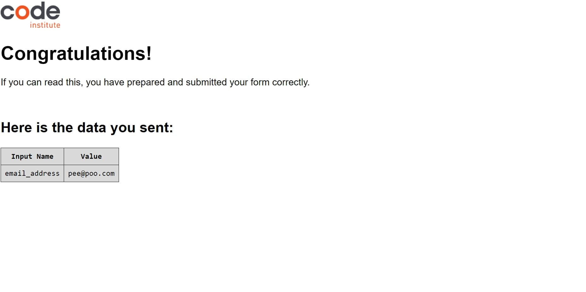

### Existing Features

* Responsive design
* Interaction-rewarding buttons
* Pulsing main images on index.html and our_story.html
* Overall design made to reward friendly competition, repeat visits, and early commitment
* Humanizing backstories, emotional tie-ins, and continuous encouragement throughout the our_story page
* Concise and blunt signup page
*  Successful signup leads to a successful page
* 3 Adventure trips and information

### Features Left to Implement

* Converting the tablet view of the lifehacks into a flashcard design, flipping around to show the text on click. This will be added in a future version.
* A hall of fame page, showing previous "winners" in the competition for the relevant months' lifehack.
* Text-cracking effect on clicking for the navbar items, matching the hammer-coming-down faux-animation on laptops, desktops, and larger tablets


## Technologies

 * HTML
    * The structure of the Website was developed using HTML as the main language.
 * CSS
    * The Website was styled using custom CSS in an external file.
 * GitPod and Codeanywhere
    * The website was developed using CodeAnywhere and Gitpod
 * GitHub
    * Source code is hosted on GitHub and deployed using Git Pages.
 * Git 
    * Used to commit and push code during the development of the Website
 * Font Awesome
    * Icons obtained from https://fontawesome.com/ were used as the Social media links in the footer section. 
 * Unsplash
    * Unsplash was used to get most of the images for this site, barring the lifehack ones
 * WebP.to
    * WebPs were edited using WebP.to
 * Convert.io
    * favicon was made using Convert.io
 * Quillbot
    * Quillbot was used to rewrite sections taken from https://www.familyhandyman.com/list/life-hacks-youll-wish-you-knew-sooner/ 

## Testing 

### Responsiveness

All pages were tested to ensure responsiveness on screen sizes from 320px and upwards as defined in [WCAG 2.1 Reflow criteria for responsive design](https://www.w3.org/WAI/WCAG21/Understanding/reflow.html) on Chrome, Edge, Firefox, and Opera browsers.

Steps to test:

1. Open the browser and navigate to [Task Smasher](https://acelliott1218.github.io/task-smasher/index.html)
2. Open the developer tools (right-click and inspect)
3. Set to responsive and decrease width to 320px
4. Set the zoom to 50%
5. Click and drag the responsive window to maximum width

Expected:

Consistent, easy-to-read content across all screen sizes
The content of the site changes in style, but not overall effect, as the screen grows larger
More screen size means more content, specifically the appearance of the mindset boxes

Actual:

Website succeeded expectations, showing no compatibility errors on Chrome, Firefox, Edge, Safari, or OperaGX. 


### Accessibility

[Wave Accessibility](https://wave.webaim.org/) tool was used throughout the development and for the final testing of the deployed website to check for any aid accessibility testing.

Testing was focused to ensure the following criteria were met:

- All forms have associated labels or aria-labels so that this is read out on a screen reader to users who tab to form inputs
- Color contrasts meet a minimum ratio as specified in [WCAG 2.1 Contrast Guidelines](https://www.w3.org/WAI/WCAG21/Understanding/contrast-minimum.html)
- Heading levels are not missed or skipped to ensure the importance of content is relayed correctly to the end user
- All content is contained within landmarks to ensure ease of use for assistive technology, allowing the user to navigate by page regions
- HTML page lang attribute has been set
- Aria properties have been implemented correctly
- WCAG 2.1 Coding best practices being followed

Manual tests were also performed to ensure the website was as accessible as possible and an accessibility issue was identified.

Images within DIVs, relying on a background image property, were not able to be given alt-text in a way that retains site functionality and feel. 

### Lighthouse Testing

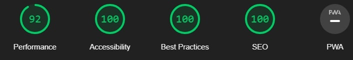

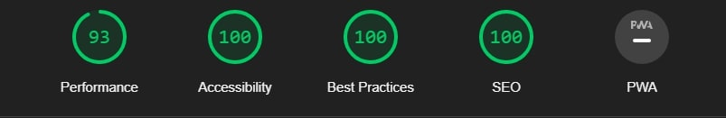

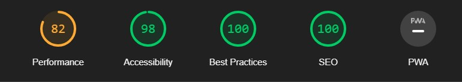

### Functional Testing

**Navigation Links**

Testing was performed to ensure all navigation links on the respective pages, were navigated to the correct pages as per design. This was done by clicking on the navigation links on each page.

| Navigation Link | Page to Load    |
| --------------- | --------------- |
| Smash Those Tasks!            | index.html      |
| Our Story       | our_story.html |
| Sign Up         | signup.html    |

Links on all pages navigated to the correct pages as expected.

**Form Testing**

The form on the home page was tested to ensure it functioned as expected when correct data was input and when incorrect data was input. The following test scenarios were covered:

_Scenario One - Correct Inputs on Footer_

Steps to test:

1. Navigate to [Task Smasher -- Home Page](https://acelliott1218.github.io/task-smasher/index.html) or [Task Smasher -- Our Story](https://acelliott1218.github.io/task-smasher/our_story.html)
2. Scroll down to the form and input the following data:
   - Email: email@gmail.com
3. Click Submit
4. The user should be redirected to the CI form success page.

Expected:

The form is submitted with no warnings or errors and the user is redirected to the CI form success page.

Actual:

The website behaved as expected with no errors or warnings and redirected to the CI form success page.

True on both pages.

_Scenario Two - Correct Inputs on Signup Page_

Steps to test:

1. Navigate to [Task Smasher -- Signup Page](https://acelliott1218.github.io/task-smasher/signup.html)
2. Scroll down to the form and input the following data:
   - Email
3. Click Submit
4. The user should be redirected to the CI form success page.


Expected:

The form submits with no warnings or errors and the user is redirected to the CI form success page.

Actual:

The website behaved as expected with no errors or warnings and redirected to the CI form success page.


_Scenario Three - Not an Email_

Steps to test:

1. Navigate to [Task Smasher -- Signup Page](https://acelliott1218.github.io/task-smasher/signup.html),  [Task Smasher -- Our Story](https://acelliott1218.github.io/task-smasher/our_story.html) (footer),  [Task Smasher -- Home Page](https://acelliott1218.github.io/task-smasher/index.html) (footer)
2. Scroll down to the form and input the following data:
   - John.com
3. Click Submit

Expected:

The form does not submit and an Error is displayed to tell the user that the field is required.

Actual:

The website behaved as expected, an error message was displayed and the form was not submitted.


**Footer Social Media Icons / Links**

Testing was performed on the Font Awesome Social Media icons in the footer to ensure that each one opened in a new tab and that each one had a hover effect of the orange branding color.

Each item opened a new tab when clicked as expected and the correct hover color was present.

**Footer Contact Information**

Testing was performed on the email to ensure it opened in a new tab and also sent to the correct email.

_Steps to test Telephone Number_

1. Navigate to [Task Smasher - Home Page](https://acelliott1218.github.io/task-smasher/index.html) or [Task Smasher - Story Page](https://acelliott1218.github.io/task-smasher/our_story.html)
2. Click the email in the footer (tasksmasher@gmail.com)

Expected:

A separate tab opens to an email application, with the relevant email prefilled.

Actual:

Behavior was as expected and my Gmail application was opened ready to send an email to the target address.

### Validator Testing 

- HTML
  - No errors were returned when passing through the official [W3C validator](https://validator.w3.org)

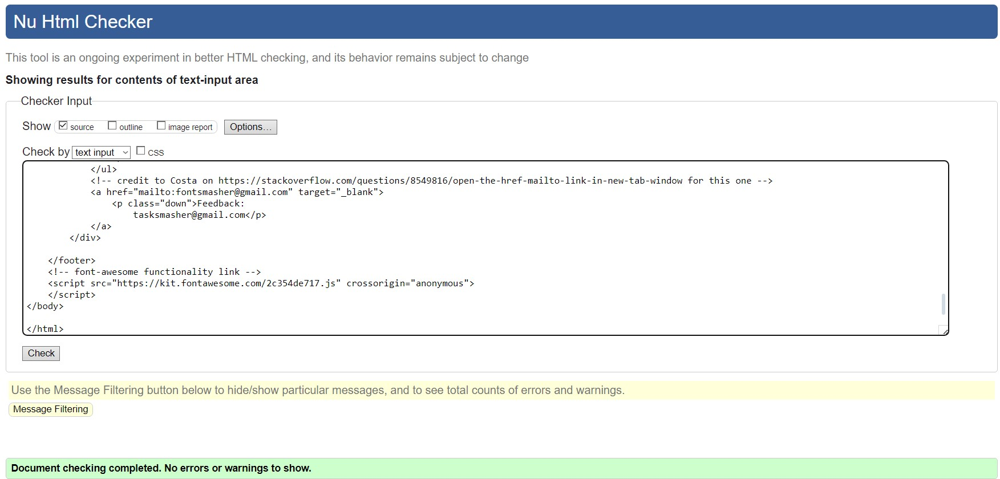

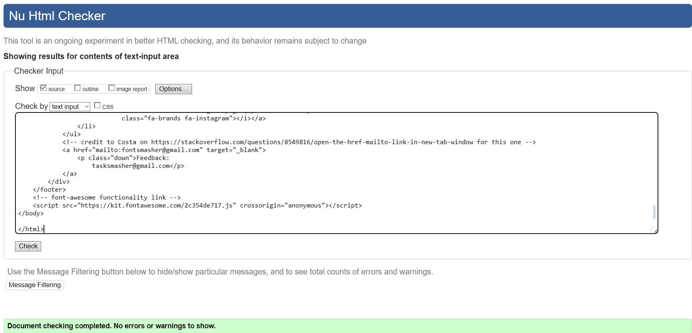

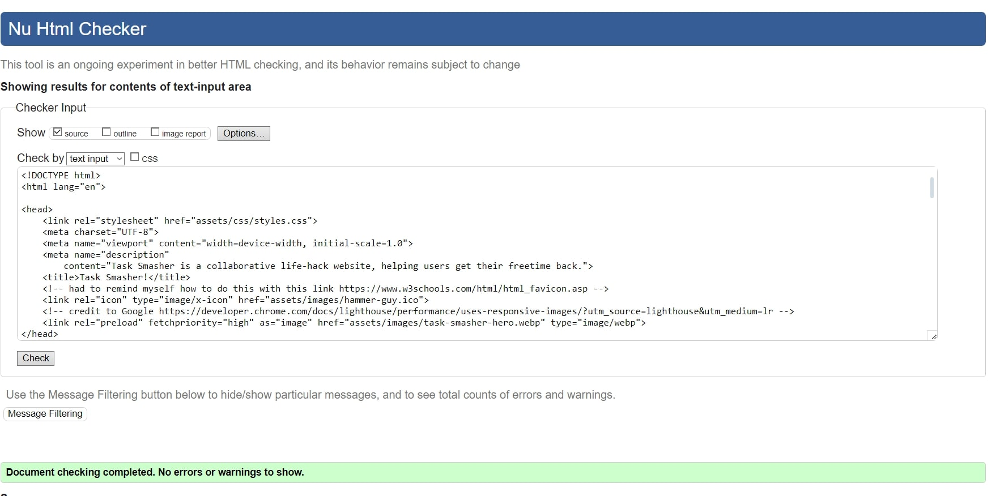


- CSS
  - No errors were found when passing through the official [(Jigsaw) validator](https://jigsaw.w3.org)

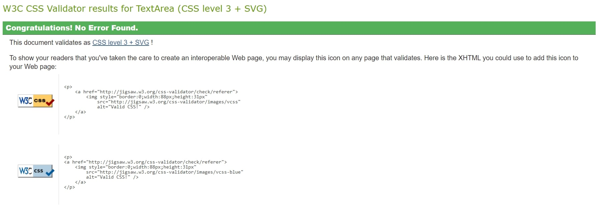

### Unfixed Bugs

 - FA icons stick too closely to the headings on our_story.html, could
   not find a quick fix for this. Will be fixed in a future release.

## Deployment

### Version Control

The site was created using Codeanywhere at first and, later, Gitpod, and pushed to Git Hub to the remote repository ‘task-smasher’.

The following git commands were used throughout development to push code to the remote repo:

```git add .``` - This command was used to add all changes made during the development process

```git commit -m “commit message”``` - Used to commit the changes added through git add, along with commentary outlining what each commit did

```git push``` - Sent all committed changes to the remote repository on Github.com

### Deployment to Github Pages

- The site was deployed to GitHub pages. The steps to deploy are as follows: 
  - In the GitHub repository, navigate to the Settings tab 
  - From the menu on the left select 'Pages'
  - From the source section drop-down menu, select the Branch: main
  - Click 'Save'
  - A live link will be displayed in a green banner when published successfully. 

The live link can be found here - https://acelliott1218.github.io/task-smasher/index.html

### Clone the Repository Code Locally

Navigate to the GitHub Repository you want to clone to use locally:

- Click on the code drop-down button
- Click on HTTPS
- Copy the repository link to the clipboard
- Open your IDE of choice (git must be installed for the next steps)
- Type git clone copied-git-URL into the IDE terminal

The project will now be cloned on your local machine for use.
## Credits 
 * [Taco's Travels](https://github.com/Gareth-McGirr/tacos-travels)
    * This README was made using the Taco's Travels README.
 * [Love Running](https://github.com/Code-Institute-Org/love-running-2.0) 
   * used multiple snippets of code as the basis for portions of Task Smasher, and the images on the Our Story and home pages are inspired by its design.
 * [FamilyHandyMan](https://www.familyhandyman.com/list/life-hacks-youll-wish-you-knew-sooner/ ) 
   * Their life-hack images were present on the home page on phones and tablets in pre-final versions, as a sort of proof of content. These images have since been replaced.
   * Content of their relevant life hack was fed into Quillbot, then rewritten further.
 * [Hubspot](https://blog.hubspot.com/website/change-background-color-html-vb)
    * Initial gradient background code came from them
   
   
 * [Florin-pop](https://www.florin-pop.com/blog/2019/03/css-pulse-effect/)

    * Huge props for the pulse animation, which is used repeatedly throughout the site.
 * **ChatGPT**
   * Wrote the first mindset box
 * **Quibble**
    * Rewrote the lifehack content to have a fresh feel
 * **Grammarly**
    * Used to check spelling, second content revision after Quibble.

General code snippets were taken from W3Schools and Stack Overflow, and credited where relevant.

### Content 

All pictures with the exception of the highlighter life-hack image, which was AI-generated, were taken from Unsplash. The following creators in specific:

[Moritz Mentges](https://unsplash.com/@mphotographym) -- Hero Image
[Giu Vicente](https://unsplash.com/@giuvicente) -- Our Story focus image
[Jonny Gios](https://unsplash.com/@supergios) -- Home page focus image
[Maria Ziegler](https://unsplash.com/@schluesseldienstvergleich_eu)  -- Keys picture
[charlesdeluvio](https://unsplash.com/@charlesdeluvio) -- Laundry picture
[Gayatri Malhotra](https://unsplash.com/@gmalhotra) -- Dog picture


### Media

[Rendernet](https://rendernet.ai/app/text-to-image) -- generated the book and lemons picture.
